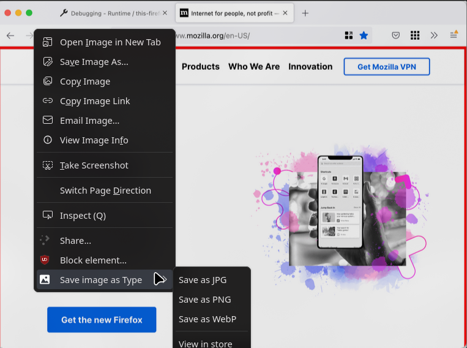

# Save Image as Type - Firefox Extension

## Overview

Save Image as Type is a Firefox extension that adds a **Save Image as PNG / JPG / WebP** option to the right-click context menu of images. This allows users to quickly save images in their preferred format without needing additional conversion tools.

This is a Firefox-compatible port of [Save-Image-as-Type](https://github.com/image4tools/Save-Image-as-Type) with modifications for better compatibility and organization.



### [Install from Firefox Add-ons](https://addons.mozilla.org/firefox/addon/siat/)

---

## Installation

### Install from Firefox Add-ons

1. Visit the [Firefox Add-ons page](https://addons.mozilla.org/firefox/addon/siat/).
2. Click **Add to Firefox**.
3. Follow the prompts to install the extension.

### Install from Source

1. Clone the repository:
   ```sh
   git clone https://github.com/d7om/Save-Image-as-Type.git
   cd Save-Image-as-Type
   ```
2. Load the extension in Firefox:
   - Open `about:debugging` in Firefox.
   - Click **This Firefox**.
   - Click **Load Temporary Add-on**.
   - Select the `manifest.json` file inside the project folder.

---

## Development Setup

### Running in Development Mode

1. Install [web-ext](https://github.com/mozilla/web-ext) if you haven't:
   ```sh
   npm install
   ```
2. Run the extension in a temporary Firefox instance:
   ```sh
   npm start
   ```
3. Make changes and reload the extension as needed.

### Building the Extension

To package the extension for distribution:

```sh
npm run build
```

---

## Contributing

### How to Contribute

1. Fork the repository.
2. Create a new branch for your changes:
   ```sh
   git checkout -b feature-name
   ```
3. Make your changes and commit them:
   ```sh
   git commit -m "Describe your changes"
   ```
4. Push your changes:
   ```sh
   git push origin feature-name
   ```
5. Open a pull request.

### Adding a New Locale

1. Copy the `_locales/en/messages.json` file.
2. Rename it to your language code (e.g., `_locales/fr/messages.json`).
3. Translate the contents accordingly.
4. Submit a pull request with the new locale.

---

## Credits

- Original project: [Save-Image-as-Type](https://github.com/image4tools/Save-Image-as-Type)
- Maintained and ported to Firefox by [@d7om](https://github.com/d7om)

---

For any issues or feature requests, please open an issue on [GitHub](https://github.com/d7om/Save-Image-as-Type/issues).
